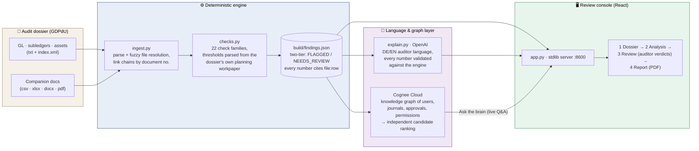

# fraudmind

**Deterministic fraud-hunting over audit dossiers — no number without a source.**

Built at the Berlin Summer Lock-In hackathon (cortea fraud-hunt track), 2026-07-18.
fraudmind ingests a German GDPdU audit export (GL, subledgers, fixed assets + accompanying
documents), links every transaction into cross-document chains, runs a catalog of deterministic
fraud/misstatement checks, and serves an interactive review console backed by a Cognee knowledge
graph. Every finding cites its exact source: `file:row`, `file#sheet:row`, or `file:page`.

**The engine decides numbers · AI writes language · the auditor decides verdicts.**

```bash
python3 ingest.py "path/to/dossier" && python3 checks.py && python3 app.py
# → build/findings.json + review console at http://127.0.0.1:8600
```

## Results on the FINAL dossier (Beispiel Dämmstoffe GmbH — 1,083,723 GL lines)

The pipeline ran **unchanged** on the previously unseen final dossier. All thresholds —
materiality €1M, JET de-minimis €50k, lock date 15.01.2026, management user IDs
(BSP-U02/U09/U10), round-amount multiple €10k, designated full-review account 484080 —
were parsed at runtime from the dossier's **own audit-planning workpaper**. Zero hardcoded
identifiers. Result: **54 findings (20 FLAGGED / 33 NEEDS_REVIEW / 1 INFO)**, each with
row-level evidence:

| Lead finding | Amount |
|---|---|
| **GL-596001 posted WITHOUT release** by management user BSP-U09 — 30.12.2025 **22:47**, status literally "GEBUCHT OHNE FREIGABE", 6× materiality | **€6,000,000** |
| **Four quarter-end journals created AND approved by the same management user BSP-U02** (31.03 / 30.06 / 30.09 / 29.12 — each above €1M materiality) | €4,394,040 |
| Manual GL lines entered **after the 15.01.2026 lock date** into the closed year | €3,593,881 |
| Rare manual postings on retained-earnings accounts 945000/940000 (<10 postings p.a.) | ~€55.9M vol. |
| Unapproved bank-details change (ALPEN TECHNIK, field Bankverbindung) — payment-redirection vector | — |
| 11 customers over their credit limit while the credit report shows no block | €412,256 |

Corroboration in review tier: two more "GEBUCHT OHNE FREIGABE" journals by BSP-U10,
management-user journal volumes (K3), bill-and-hold agreement flagged for revenue-recognition
review, receivables from insolvency-listed customers.

## Knowledge-graph cross-validation (Cognee Cloud)

The dossier's **relationship facts** — 275 notable approval-log rows (creator → journal →
approver → status → amount), all 59 master-data changes, the permissions matrix, legal cases,
planning criteria, plus raw evidence rows — were cognified into dataset
`beispiel_d_mmstoffe_gmbh_2025` (5 documents). An **independent graph query** ("act as a
forensic auditor, extract and rank fraud candidates from the relationship facts") returns the
same top candidates the deterministic engine flagged, and adds combined-fact reasoning
(permissions that don't match actions, parties with legal cases and open balances). Two
independent methods converging on one fraud narrative — that is the traceability story.

## Results on the practice dossier

**18 findings (11 FLAGGED / 6 NEEDS_REVIEW / 1 INFO), ≈ €638k quantified impact** — all four
planted schemes found, zero decoys wrongly accused (validated against the answer key):

| Scheme | Amount |
|---|---|
| Phantom/related-party vendor (self-approved by its own creator, paid in 2 days, zero deliverables) | €295,120 gross / €248,000 net |
| Cut-off manipulation: 8 ghost vendors, Dec services invoiced in Jan, no accrual — triple-corroborated | €192,000 |
| Repairs capitalized as fixed assets (6 additions) | €150,800 |
| Same-day split payments under the €10k approval limit | €39,040 |
| Opening balances unverifiable (empty prior-year TB vs. IT completeness attestation) | — |

Full write-up: [REPORT.md](REPORT.md). Machine-readable: `build/findings.json` after a run.

## Architecture



**The contract:** the engine decides every number (deterministic, cited) · AI writes language
only (validated) · the knowledge graph connects entities (cross-validation) · the auditor
decides verdicts.

## Review console (the auditor workflow)

- **Fraud-type headline first**: every case opens with its scheme and one sentence on why the
  pattern matters; details are progressive-disclosure folds.
- **Decisions on the left**: Confirm fraud / Follow-up / Dismiss + reviewer note, directly under
  the finding queue; every queue item shows confidence, amount, and evidence count at a glance.
- **Clickable evidence**: each `file:row` citation opens the actual source record in-app with the
  cited row highlighted in context (`/api/source`).
- **Ask the brain**: live Q&A against the Cognee knowledge graph, answers cross-checked against
  deterministic findings.
- **PDF report**: one click produces a formal audit report (scheme headlines, methodology,
  evidence citations, human verdicts). Plus in-app preview and Markdown export.

## Why the results hold up

- **Rules decide, the LLM explains.** Amounts, matches, and violations come from deterministic
  reconciliation — no hallucinated numbers.
- **Two-tier output** (FLAGGED vs NEEDS_REVIEW) protects against false-positive penalties;
  seeded innocent discrepancies stay out of FLAGGED.
- **Anti-overfitting by design**: thresholds and control definitions are read from each dossier's
  own audit-planning workpaper at runtime; user-ID patterns, document prefixes, and journal
  markers are derived from the data itself; time-based checks self-calibrate against the
  dossier's base rates (the practice company posted 28.5% of entries on weekends — so weekends
  were not "odd hours" there; the final company posts 11% at night — so night alone flags
  nothing); population-level observations aggregate into single findings. The learned policies
  live in [.claude/skills/audit-detectors/SKILL.md](.claude/skills/audit-detectors/SKILL.md).
- **Rename-tolerant ingest**: fuzzy file resolution with year-token guards; renamed or missing
  companion documents degrade gracefully instead of crashing (the final dossier renamed 5 files
  and dropped the goods-receipt list — the pipeline ran unchanged).

## Setup

```bash
pip install openpyxl            # xlsx parsing; pdftotext (poppler) optional for PDFs
```

Optional, for the "Ask the brain" panel — a Cognee Cloud account:

```bash
# .env  (never committed)
COGNEE_BASE_URL=https://<tenant>.aws.cognee.ai
COGNEE_API_KEY=<key>
```

## Run

```bash
python3 ingest.py "path/to/dossier"     # parse + link -> build/
python3 checks.py                       # run checks   -> build/findings.json + console report
python3 app.py                          # review UI    -> http://127.0.0.1:8600
```

End-to-end in ~40 seconds on the 1.08M-row final dossier; dossier-agnostic — point it at a new
folder and it reruns unchanged.

## Check catalog (22 families)

Master-data self-approval & SoD (vs. permissions matrix) · party-creation-control bypass ·
cut-off both directions (unrecorded liabilities + premature revenue) · repair-capitalization ·
journal-approval coverage, self-approval & posted-without-release · approver-without-permission ·
JET time-profile (self-calibrating) · round amounts · split payments with 7-day clustering ·
subledger↔GL↔OP-list tie-outs · credit-limit report vs books · document-sequence gaps ·
prior-year completeness contradiction · bank-change payment flows · invoices outside the billing
journal · material purchases without goods receipt · near-duplicate parties · locked-posting
changes (GoBD) · entries after lock date / backdated · management-user manual journals ·
rarely-used accounts + designated full-review account · insolvency receivables & bill-and-hold.

## Partner tech

- **Cognee** — knowledge graph over the dossier's relationship facts; powers the live
  "Ask the brain" Q&A and independent graph-based fraud-candidate extraction that
  cross-validates the deterministic engine.
- **OpenAI** — auditor-language explanation layer (explain.py, gpt-4.1-mini): DE/EN headlines,
  explanations, and next audit steps per finding; every numeric token in the AI text is
  validated against the engine finding ("figures verified" badge) — the LLM never introduces
  a number.
